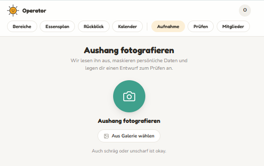
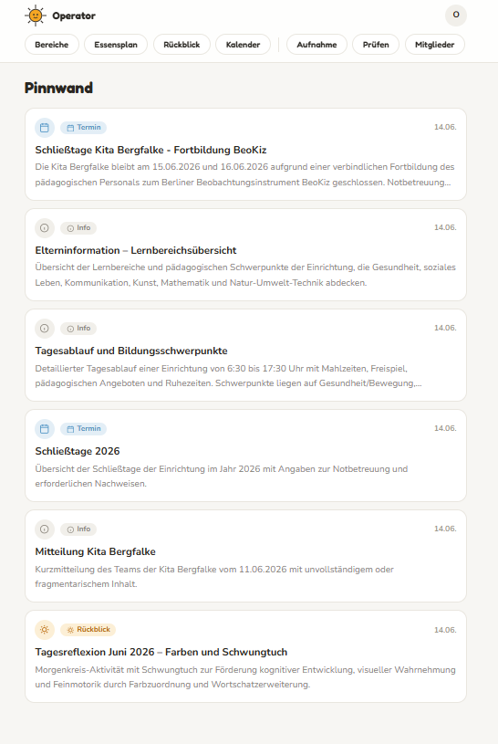
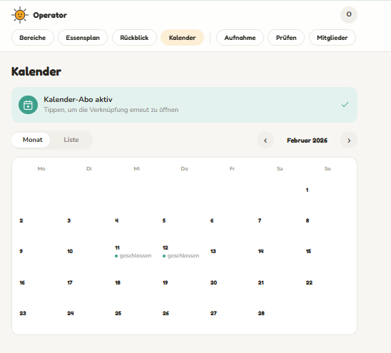
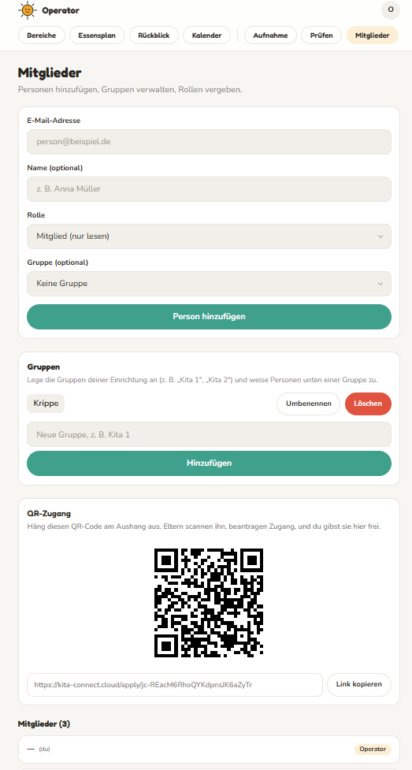

# Final Project — AI Solution with Compliance & Strategic Implementation

[](https://kita-connect.cloud)
[](https://github.com/eugnmueller-87/DIGITNEWS)
[](compliance/eu_ai_act_compliance.md)
[](compliance/gdpr_documentation.md)
[](poc/poc_documentation.md)
[](simulation/)


**Author:** Eugen Müller
**Use case / industry:** AI-assisted **digitization of the paper notice board** for small,
low-tech community organizations (**Kitas**, clubs, churches, allotment associations).
**The one idea:** *the LLM advises, PII is masked first, a human decides* — an AI reads a
photographed notice and **suggests** structure; PII is redacted **locally before any external AI
call**; an admin **confirms** before anything is published. Privacy and the advise/decide boundary
are enforced by architecture, not policy.

**Live:** [kita-connect.cloud](https://kita-connect.cloud) (invite-only; live & in real-world
testing) · **[MVP source](https://github.com/eugnmueller-87/DIGITNEWS)** ·
**Presentation:** [`presentation.html`](https://htmlpreview.github.io/?https://raw.githubusercontent.com/eugnmueller-87/final-project-eugen/main/presentation.html) (open in a browser)

---

## Product tour

Screens from the **live MVP** (German UI) — the whole loop, photo → private feed → calendar → admin.

<table>
  <tr>
    <td width="50%" valign="top">
      <a href="mvp/screenshots/01-capture.png"></a>
      <p align="center"><b>1 · Capture</b><br>Admin photographs the paper board. &ldquo;We read it, mask personal data, and prepare a draft for review.&rdquo;</p>
    </td>
    <td width="50%" valign="top">
      <a href="mvp/screenshots/02-feed.png"></a>
      <p align="center"><b>2 · Private feed</b><br>The notice comes back as <i>typed</i> posts (Termin / Info / Rückblick) — structure the LLM <i>suggested</i> and the admin <i>confirmed</i>.</p>
    </td>
  </tr>
  <tr>
    <td width="50%" valign="top">
      <a href="mvp/screenshots/03-calendar.png"></a>
      <p align="center"><b>3 · Calendar + ICS</b><br>Events land on a shared calendar members can subscribe to (ICS), so closures and dates sync to their own phone.</p>
    </td>
    <td width="50%" valign="top">
      <a href="mvp/screenshots/04-members.png"></a>
      <p align="center"><b>4 · Members &amp; onboarding</b><br>Invite-only members, groups, and roles — plus a QR poster for the board so parents can request access.</p>
    </td>
  </tr>
</table>

---

## Core deliverables (1–7)

### 1. Use Case Definition — ✅ done
[`use_case_definition.md`](use_case_definition.md)
Business problem · organization profile · AI solution (with system types: perception/OCR,
local PII classification, LLM structured extraction) · stakeholders · 4 measurable success criteria ·
out-of-scope boundaries.

### 2. No-/Low-Code POC — ✅ done
[`poc/poc_documentation.md`](poc/poc_documentation.md)
**Four importable n8n workflows** mirroring Aushang's pipeline — each runs end-to-end on mock data,
no application code:

1. **Redaction boundary** — mask PII locally → fail-closed assert → only redacted text crosses
2. **Extract → schema-validate** — Claude *suggests* on redacted text → validate or route to manual
3. **Confirm → route → publish** — admin corrects the type & publishes → route by the *confirmed* value
4. **Double-gated photo consent** — original released only on member opt-in × admin release

Every workflow shows the boundary: a **Code** node owns the redaction/validation/routing/consent
decision; the **Claude** node only advises.
*(Optional: a 2–5 min screen recording link can be added to the doc; capture screenshots into
`poc/poc_screenshots/`.)*

> **End-to-end simulation:** [`simulation/`](simulation/) is a zero-dependency Node.js harness that
> simulates **every** project workflow on mock data with **no live infrastructure** — the core
> capture→publish pipeline, onboarding, delivery (digest/ICS/push), privacy gates, cross-org
> isolation, and the four n8n POC workflows (executed node-by-node from their real JSON). Run
> `node simulation/run.js` → **52 assertions, all green.** See [`simulation/README.md`](simulation/README.md).

### 3. ROI & Risk Assessment — ✅ done
[`roi_risk_assessment.md`](roi_risk_assessment.md)
Build (~€35k, largely sunk — MVP is live) + ongoing (~€8k/yr, dominated by owner time; **~€1.3k/yr
cash infra**) · break-even on infra at **~15 orgs** · 9-row assumptions table · **8-risk matrix**
(regulatory/technical/ethical/operational) with L×I scores + mitigations. Honest framing:
cheap to run, feature proven, **payback is a distribution question** (a channel), not a tech one.

### 4. EU AI Act Compliance — ✅ done
[`compliance/eu_ai_act_compliance.md`](compliance/eu_ai_act_compliance.md)
Classification (**Limited risk**) · step-by-step decision-tree reasoning (no Annex III area — makes
no decision *about a person*; Kita context is communication, not education-access) · mandatory-
requirements summary · 1–2 page **Conformity Assessment Summary** · **Technical Documentation
Outline** (Annex-IV skeleton).

### 5. GDPR Documentation — ✅ done
[`compliance/gdpr_documentation.md`](compliance/gdpr_documentation.md)
Data-flow map · processing-activities register · **DPIA** on the highest-risk activity (capturing a
board that may name children) · data-subject rights · third-party transfers. Key property:
**no raw image and no un-redacted PII is ever sent to the external LLM** — PII is masked locally
first, and raw-PII columns are REVOKE'd from members at the DB.

### 6. Strategic Deployment & Commercialisation — ✅ done
[`strategic_plan.md`](strategic_plan.md)
Phases (Build → POC → Pilot → Multi-org → Channel) · timeline + milestones + gates · go-to-market
(channel-led: association/Träger) · stakeholder communication plan · KPIs per phase ·
commercialisation model (per-org SaaS via a channel, self-serve as proof).

### 7. Presentation — 🟡 HTML done; PDF export pending
[`presentation.html`](https://htmlpreview.github.io/?https://raw.githubusercontent.com/eugnmueller-87/final-project-eugen/main/presentation.html) — 11-slide self-contained deck (keyboard/swipe nav),
also outlined in [`presentation_outline.md`](presentation_outline.md) with Q&A prep.
- 🟡 **You add:** export to `presentation.pdf` (browser → Print → Save as PDF) if a PDF is required.

## Stretch deliverable (8)

### 8. Working MVP — ✅ done (live)
[`mvp/mvp_documentation.md`](mvp/mvp_documentation.md) · **live** + [code](https://github.com/eugnmueller-87/DIGITNEWS)
A deployed, working AI system (not a mockup): the full capture → OCR → local redaction → LLM
extraction → human review → publish pipeline runs in production; a first Kita is testing it.
Architecture · setup · run · limitations · how it extends the POC. Four-layer security model,
adversarially reviewed (`SECURITY.md` in the source repo). Post-launch it also gained per-user
**English/German** UI, decorative **AI cover images** (zero-PII, EU-endpoint-ready, dormant), a
**reflection-photo deletion** privacy rule (migration `0023`), and a **Capacitor Android native
shell** (remote-URL mode) that builds a Play-ready AAB in CI — toward an app-store presence for the
Kita channel (see `mvp/mvp_documentation.md` §8–9).

---

## Submission checklist (mirrors the rubric)

**Core**
- [x] `use_case_definition.md`
- [x] POC: 4 n8n workflows + documentation (optional: screenshots + demo recording link)
- [x] `roi_risk_assessment.md`
- [x] `compliance/eu_ai_act_compliance.md`
- [x] `compliance/gdpr_documentation.md`
- [x] `strategic_plan.md`
- [~] Presentation: `presentation.html` ✅ · `presentation.pdf` export 🟡

**Stretch**
- [x] `mvp/mvp_documentation.md`
- [x] GitHub repository (MVP): https://github.com/eugnmueller-87/DIGITNEWS

---

## Repository structure

```
final-project-eugen/
├── README.md
├── presentation.html              # 11-slide deck (→ export presentation.pdf)
├── presentation_outline.md
├── use_case_definition.md         # 1
├── poc/                           # 2
│   ├── poc_documentation.md
│   ├── 1_redaction_boundary.workflow.json
│   ├── 2_extract_validate.workflow.json
│   ├── 3_confirm_route_publish.workflow.json
│   └── 4_photo_consent_gate.workflow.json
├── roi_risk_assessment.md         # 3
├── compliance/
│   ├── eu_ai_act_compliance.md    # 4
│   └── gdpr_documentation.md      # 5
├── strategic_plan.md              # 6
└── mvp/                           # 8 (stretch — code lives at DIGITNEWS)
    └── mvp_documentation.md
```

## What makes this submission strong

1. **The MVP is live and real** — the AI runs end-to-end in production (OCR → local redaction → LLM
   extraction → human review → publish), with a real Kita testing it. Not a mockup.
2. **Privacy is argued *and* enforced** — "no PII to the AI" is not a promise: PII is masked
   **locally before any external call**, raw-PII columns are DB-`REVOKE`'d from members, photo
   consent is double-gated, reflection originals (most likely to show children) are **deleted at
   publish** (migration `0023`), and a build-blocking secret scan guards the boundary. The public
   privacy page states the US-LLM step **truthfully**, not glossed.
3. **POC is genuinely no-code** — four importable n8n workflows showing the redaction boundary, the
   advises/decides split, the human-confirm publish, and the consent gate — distinct from the MVP.
4. **Compliance is reasoned, not asserted** — the EU AI Act classification walks the decision tree
   (why *not* High-risk / Annex III); the GDPR DPIA honestly takes on real personal data (a Kita
   board) rather than claiming none exists.
5. **The ROI is honest** — it states plainly that single-org self-serve doesn't repay the build, and
   identifies the real lever (a distribution channel) instead of inventing a heroic savings number.
